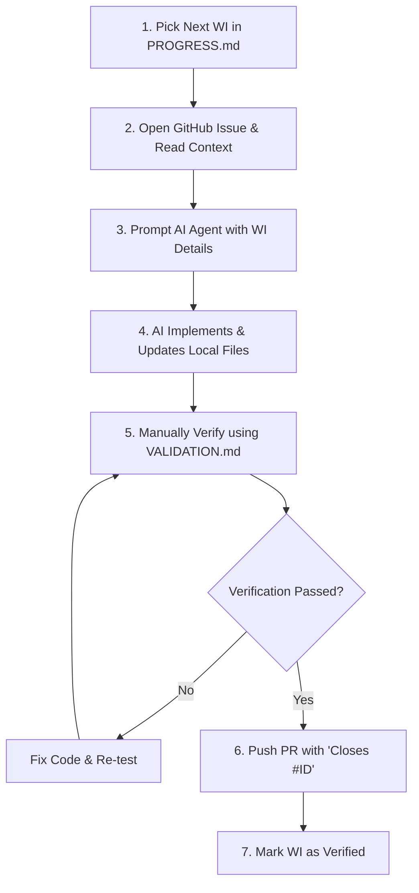

# AI-Assisted Development Guide

This guide describes how to use AI coding agents (such as Antigravity) to implement the **Trainifyer Mailbox Monitoring** platform step-by-step. By following this loop, you will maintain high code quality, avoid regressions, and ensure progress is continuously synced with your GitHub board.

---

## The AI Development Loop (Repeat for each Work Item)

For each work item in `WORKITEMS.md`, execute this exact loop:



### Step 1: Pick the Next Work Item
Open **[PROGRESS.md](file:///d:/AiSoft/Code/trainifyer-mailbox-monitoring/PROGRESS.md)** and identify the first item marked `Not Started`.

### Step 2: Open GitHub Issue
Click the link next to the work item ID in `PROGRESS.md` to view the corresponding GitHub Issue. Review the acceptance criteria and any developer notes.

### Step 3: Prompt the AI Agent
Copy the task prompt template (see below) and provide it to your AI coding agent. **Never ask the agent to work on multiple tasks across different phases simultaneously.**

### Step 4: AI Implementation & Local Log Update
The AI agent will:
1. Create or modify the necessary code files in the `frontend/` or `backend/` folders.
2. Mark the task status in **[PROGRESS.md](file:///d:/AiSoft/Code/trainifyer-mailbox-monitoring/PROGRESS.md)** from `Not Started` to `In Progress` and then `Done` once compiled.
3. Document the changes in **[CHANGELOG.md](file:///d:/AiSoft/Code/trainifyer-mailbox-monitoring/CHANGELOG.md)** (specifying files affected).

### Step 5: Manual Developer Verification
Before proceeding, you must manually run the local verification scenario specified in **[VALIDATION.md](file:///d:/AiSoft/Code/trainifyer-mailbox-monitoring/VALIDATION.md)** to verify the feature works exactly as expected.

### Step 6: PR Creation and Git Push
Commit the changes, create a git branch, and submit a Pull Request. Always include the phrase `Closes #<issue_number>` in your pull request description so GitHub automatically closes the issue and moves the project card to Done.

---

## Core Guidelines for AI Prompts

* **Mock Context-First**: Remind the agent that in Phases 1–7, they must use the mock session context (reading user role and ID from request query parameters/headers or the React provider contexts) instead of real logins.
* **Security-Later**: Remind the agent that actual Supabase Auth, JWT verification, and Database RLS are strictly out of scope until Phase 8.
* **No Secret Commits**: Instruct the agent to store all environment configurations in `.env` and never hardcode API keys or secret tokens.

---

## First Prompt: Starting Phase 1 (WI-101 & WI-102)

Copy and paste the prompt below into the AI coding agent to begin development:

```text
Please begin execution of Phase 1 of the Trainifyer Mailbox Monitoring Platform. You will implement:
- WI-101 (Repository Setup & Environment Boilerplate) - GitHub Issue #1
- WI-102 (Express API Server Setup with Mock Session Middleware) - GitHub Issue #2

Refer to:
- WORKITEMS.md for WI-101 and WI-102 detailed criteria
- RULES.md and GOALS.md for architecture expectations

Instructions:
1. Initialize the backend workspace: Create a directory named `backend/` and initialize it with `npm init -y`.
2. Configure `package.json` with scripts: "start" (node index.js) and "dev" (nodemon index.js or node --watch index.js).
3. Install dependencies: express, dotenv, cors. Install nodemon as a dev dependency.
4. Create a `.gitignore` to ignore `node_modules` and `.env`.
5. Create a `.env.example` file.
6. Write `backend/index.js` setting up the Express app.
7. Implement the Mock Session Middleware: Read `x-mock-role` and `x-mock-user-id` from request headers (fallback to `role` and `userId` query parameters). Log the simulated user info to the console on every request.
8. Expose a health check endpoint at `GET /api/health` that returns:
   {
     "status": "healthy",
     "mockUser": {
       "role": req.mockUserRole,
       "id": req.mockUserId
     }
   }
9. Once completed:
   - Update PROGRESS.md: Set status of WI-101 and WI-102 to "Done".
   - Update CHANGELOG.md: Log files created.
```
