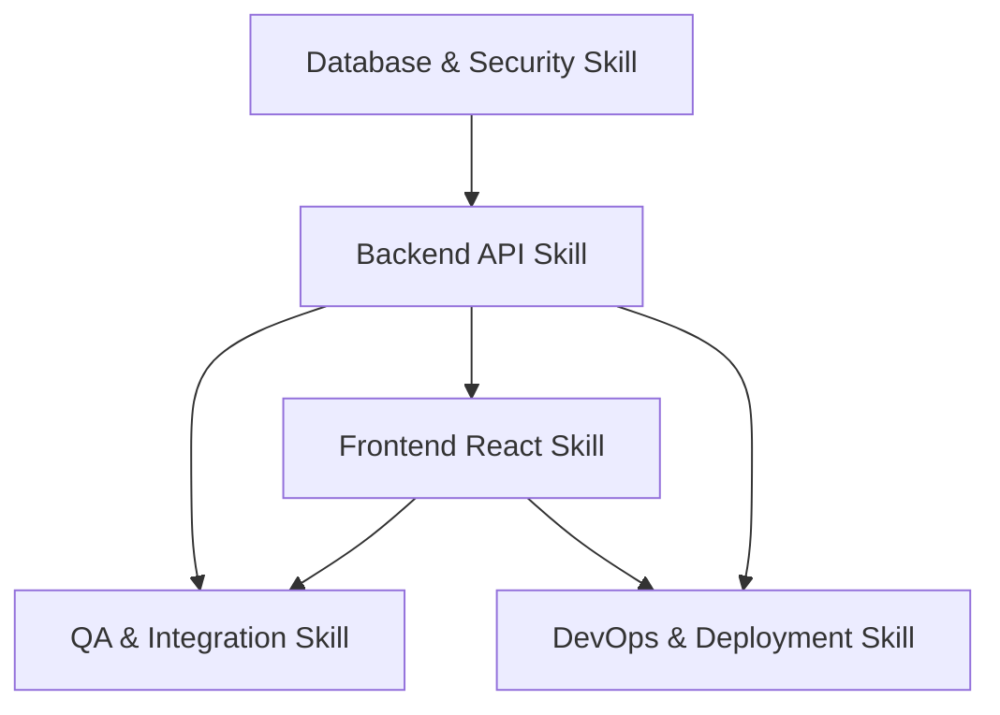

# Skills Mapping

This document outlines the engineering, security, and domain skills required to implement the **Student Learning Monitoring and Internal Communication Platform**. It organizes these skills into logical groups, defines dependencies, establishes assumptions, and maps out the necessary knowledge for developers.

---

## 1. Skill Groups

### Group A: Database & Security Architecture (DB-SEC)
* **Required Knowledge**: PostgreSQL schema design, Supabase database client, Row Level Security (RLS) policies, database triggers, foreign keys, and indexes.
* **Role**: Database Administrator / Security Engineer.
* **Focus**:
  - Designing a batch-first relational schema to support a single organization with class-based groups.
  - Ensuring complete separation of data permissions (e.g., student-to-student messaging boundaries).
  - Securely storing system configurations (settings for mailbox permissions and meeting permissions).

### Group B: Backend API Engineering (BE-API)
* **Required Knowledge**: Node.js, Express framework, Supabase Admin API, RESTful API design, JWT authentication, Express middleware, error-handling patterns, and service/repository separation.
* **Role**: Backend Developer.
* **Focus**:
  - Crafting robust backend endpoints for auth verification, user/student management, batches, internal mail, and meeting registration.
  - Restricting student accounts to admin-only controls.
  - Calculating meeting attendance using join/leave logs (time-duration math).

### Group C: Frontend Application Development (FE-DEV)
* **Required Knowledge**: React.js, Vite build tool, React Router (protected routes), State Management (context or lightweight state), CSS layouts, component reusability, and environment variables.
* **Role**: Frontend Developer.
* **Focus**:
  - Creating separate user dashboards: a comprehensive Admin view and a restricted Student view.
  - Building an internal mailbox client interface (Inbox, Sent, Compose).
  - Embedding the Jitsi Meet IFrame API.
  - Implementing the pre-meeting consent flow.

### Group D: Quality Assurance & Automation (QA-TEST)
* **Required Knowledge**: Integration testing, API boundary checks, regression testing, manual browser testing, build validation, and security auditing.
* **Role**: QA Engineer.
* **Focus**:
  - Verifying the end-to-end user flows (Admin creates student -> Student logs in -> joins meeting -> duration is calculated).
  - Auditing APIs to ensure students cannot trigger admin actions or bypass batch rules.
  - Ensuring no secrets are committed to the code repository.

### Group E: Release & Deployment (DEVOPS)
* **Required Knowledge**: Render platform config, environment variable management, build scripts, production build optimization.
* **Role**: DevOps / Release Engineer.
* **Focus**:
  - Setting up production environments on Render free tiers.
  - Configuring secure bindings between Render and Supabase.

---

## 2. Skill Dependencies

The development of this project must follow a sequential path. The mapping below illustrates which skills must be exercised before subsequent work can begin.

* **Data-First Dependency**: Frontend developers (`FE-DEV`) cannot build pages like the Mailbox UI or Dashboard reports without backend endpoints (`BE-API`) and secure database schemas (`DB-SEC`) being fully defined and validated.
* **Security Validation Dependency**: Security audit policies (`DB-SEC` / RLS) must be verified via testing (`QA-TEST`) before the application is declared ready for deployment.

---

## 3. Assumptions and Required Knowledge

### Technical Assumptions
1. **Zero-Cost Hosting**: The implementation relies on the Render Free Tier and the Supabase Free Tier. Teams must possess optimization skills to operate within CPU, RAM, and DB connection limits.
2. **Third-Party Meeting Engine**: Jitsi Meet is integrated via its public iframe API. No custom WebRTC media server setup is expected for the MVP. However, developers must understand iframe lifecycle events and JS postMessage interaction.
3. **No Real Mail server**: The mailbox is a database-backed messaging table. Standard SMTP, IMAP, and POP3 knowledge is NOT required. Developers must instead excel in database querying, read/unread flags, and join queries.

### Required Developer Knowledge Matrix

| Tech / Area | Skill Level | Required Knowledge Points |
| :--- | :--- | :--- |
| **Supabase Auth** | Intermediate | JWT verification, token extraction, role classification, Session handling. |
| **PostgreSQL** | Intermediate | Relational schemas, UUID keys, foreign key cascading, timestamp tracking, database performance. |
| **Express.js** | Intermediate | Route protection middleware, controller-service patterns, input validation. |
| **React Router** | Intermediate | Nested routes, navigation guards, redirection of unauthorized roles. |
| **Jitsi IFrame API** | Basic | IFrame configuration, event handling (joining, leaving), screen sharing browser permissions. |
| **Web Browser APIs** | Intermediate | Media Devices API (camera/microphone consent), Screen Capture API, Tab activity indicators. |
